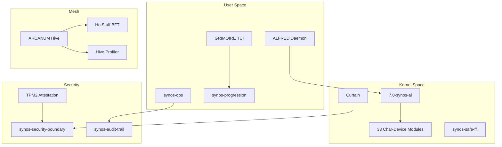

tags: [general]

# Architecture

This section is the deep-dive reference for how Syn_OS is built. It complements the
single-source-of-truth master architecture document at
[`docs/internal/eyesonly/architecture/SYNOS_MASTER_ARCHITECTURE.md`](../../../internal/eyesonly/development/project-status/reference/research/research/knowledge-sync/architecture/SYNOS_MASTER_ARCHITECTURE.md)
and the project roadmap. If a page here ever contradicts the master
document, the master document wins.

Syn_OS is an Arch Linux derivative whose subsystems all live in a single **247-crate Rust**
workspace. The subsystems below are the load-bearing pieces — each has its own page with
diagrams, crate paths, test counts, and known limitations.

---
tags: [general]

## Core Subsystems

### Custom Kernel

The **Linux 7.0-synos-ai** kernel target is built with LLVM and `CONFIG_RUST=y`, exposes
**12+ `CONFIG_SYNOS_*`** build options, loads **33 signed Rust char-device modules**
(ZeroC — zero Syn_OS-authored C in the kernel tree), and uses **char-device + ioctl**
as the kernel-userspace AI interface (replacing the obsolete custom-syscall design).

All 33 modules are CAP_SYS_ADMIN-gated, signed, and QEMU-validated (67/67 PASS on the v101
core set; 5 additional v102-v108 modules built and in pipeline). The offensive
`synos_rootkit` module is master/CoM-only (0600 root-only); all others are all-profile.

See: [custom-kernel.md](custom-kernel.md)

### ALFRED v6.0

ALFRED (**A**daptive **L**earning **F**ramework for **R**esponsive **E**volution & **D**efence)
is the Rust AI daemon. Its consciousness fusion engine combines Traditional, Neuromorphic,
Quantum, TNGS (Theory of Neuronal Group Selection), and MPS tensor-network cortex layers,
and it supports both ONNX and Ollama backends for local inference with a STIX 2.1
threat-intel ingress and federation-capable consensus.

The v53 `CortexSelector` adds a pluggable backend (`ClassicalSnn` / `MpsCortex`) on the
QuantumInspired path, selected via `SYNOS_CORTEX_BACKEND` env var.

See: [alfred.md](alfred.md)

### GRIMOIRE

GRIMOIRE is the gamified cybersecurity training platform — **117 labs across 13 categories**
(beginner, intermediate, advanced, nightmare, crypto, defence, forensics, privesc, homelab,
mesh, ai-red-team, quests, raids) backed by the `synos-gamification` daemon and a real-time
WebSocket world-server. The front-end is `grimoire-tui`, a pure terminal TUI (the Bevy 0.14
3D client is tabled). Features include playable quests, a learning-loop engine (per-lab
analytics, DEBRIEF, login streaks, adaptive next-lab, knowledge-gap heatmap), Ed25519-signed
certifications, real prestige passives, and codex unlocks.

Lab sandboxing is handled by `synos-lab-sandbox` with Firecracker microVMs, seccomp-bpf,
and per-lab capability masks.

See: [grimoire.md](grimoire.md), [grimoire-lab-firecracker-isolation.md](grimoire-lab-firecracker-isolation.md)

### synos-bevy _(tabled)_

The Bevy 0.14 game-engine crate powering the desktop experience (8 plugins: Cutscene,
Mindmap, RetroFilter, Cyberspace, SkillTree, FactionHQ, Rehoboam, Twin). **Tabled in favor
of `grimoire-tui`**; excluded from workspace resolution. The v71 Multiplayer plugin is
preserved but inactive.

See: [bevy-engine.md](bevy-engine.md)

### GRIMOIRE World Server (multiplayer)

The authoritative backend for GRIMOIRE's single shared world — every Syn_OS image
(master, public, ChurchOfMalware) joins the **same** world; the server owns
integrity-critical state (scores, faction control) on a 20 Hz tick while clients do the
heavy lifting (featherweight hosting). Runs on a native-Linux mesh node, hardened to the
tailnet (ACL + systemd sandbox + egress-lockdown; no lateral movement). Endpoint is
env-configurable (`SYNOS_WORLD_SERVER`) — moving the host is not a rebuild.

See: [world-server.md](world-server.md)

### ARCANUM Hive

The horizontally-scalable encrypted mesh for distributed Syn_OS deployments. Tailscale is
the primary backbone, WireGuard is the fallback, and a K3s operator manages node lifecycle
through the `ArcanumNode` custom resource. Node identity is established via ed25519
keypairs generated at first boot. v79 HotStuff BFT consensus provides Byzantine
fault-tolerant agreement across the mesh.

See: [arcanum-hive.md](arcanum-hive.md), [ARCANUM_MESH_ARCHITECTURE.md](ARCANUM_MESH_ARCHITECTURE.md)

### OTA Update Systems

Two complementary updaters — don't conflate them:

- **Hive-coordinated (patch-level)** — mesh nodes pull ed25519-signed patches from a
  master with btrfs snapshot rollback, canary rollout groups, and SBOM cross-reference.
  See: [ota-updates.md](ota-updates.md)
- **Standalone A/B (image-level)** — a single install updates *itself* by swapping whole
  rootfs slots, verifying the new image boots before committing (QEMU-verify + watchdog
  rollback), behind a production HTTPS transport and a **pubkey-only hybrid
  (ed25519 + ML-DSA-65) fail-closed** verifier. See: [ota-standalone.md](ota-standalone.md)

### Four-Image Architecture

Syn_OS ships as **four images** — **Master**, **GRIMOIRE Public**, **GoodLife**, and
**ChurchOfMalware** — built from one workspace. A build-time **Curtain** (ELF symbol
scanner + feature audit + lab integrity SHA-256 manifests) plus a **Curtain v4** runtime
capability ceiling enforce the boundary so proprietary capabilities never leak into the
wrong build.

| Capability | Master | GRIMOIRE | GoodLife | CoM |
|---|:---:|:---:|:---:|:---:|
| Full toolset + BlackArch | ✓ | Per-tool unlock | Safe subset | Per-tool unlock |
| Kernel modules | All 33 | 32 (no offensive) | 32 defensive | 32 + CoM offensive |
| Fragment Field IDS | Kernel + userspace | Userspace only | Userspace | Kernel + userspace |
| Lab / mesh authoring | ✓ | No | No | Member-tiered |
| C2 framework binaries | Present | Scrubbed | Scrubbed | Present |
| Offensive capability | Yes | Gated → EPERM | No | Game-mode gated |

See: [iso-profiles.md](iso-profiles.md), [CURTAIN_V2.md](CURTAIN_V2.md)

### Fragment Field IDS (Master-only)

Fragment Field IDS is an **energy-topology intrusion detection system** that treats attack
patterns as physics-layer perturbations. Attack patterns produce distinct energy topologies
(cache-miss storms for Spectre/Meltdown, elongated fragment paths for ROP chains, entropy
reduction for timing attacks) measured via RAPL + PMU + eBPF and classified in userspace.
Kernel/userspace bridge uses char-device + ioctl (not custom syscalls).

**This is a Master-only proprietary feature.** The source is `LicenseRef-Proprietary` and
excluded from the public forge.

See: [fragment-field-ids.md](../../../internal/architecture/proprietary/fragment-field-ids.md) (internal — Master only)

### SBOM Pipeline

Every ISO profile ships with a CycloneDX Software Bill of Materials. The pipeline
generates SBOMs for both the Rust workspace (`cargo-cyclonedx`) and the Docker builder
image (`syft`), signs them with cosign, and cross-references them against `deny.toml`
policy. ALFRED model weights carry their own provenance manifest with SHA-256 pins.

See: [iso-build-pipeline.md](iso-build-pipeline.md) (SBOM section)

### ISO Build Pipeline

The **51-stage** `mkarchiso` pipeline under `fruit/iso/iso-build/scripts/stages/` is the
authoritative ISO producer. It wraps `mkarchiso` in an Arch Docker container on the build
oracle, runs `pacstrap` to bootstrap the Arch base, compiles the kernel and Rust
workspace, installs Cinnamon + Xfce4, stages 155 native security tools (plus full
BlackArch on demand) and GRIMOIRE labs, builds the squashfs with `SOURCE_DATE_EPOCH`,
generates the SBOM, and publishes patch manifests. `SYNOS_STRICT=1` is always set.

See: [iso-build-pipeline.md](iso-build-pipeline.md), [iso-build-deep-dive.md](iso-build-deep-dive.md)

### Lab Sandbox

GRIMOIRE labs run inside `synos-lab-sandbox` — Firecracker microVMs with seccomp-bpf
isolation, per-lab capability masks, a golden-file regression suite, and a Criterion
benchmark suite. The `vetted_catalog` allowlist is a fixed, hand-maintained list between
"what an author can describe" and "what the platform executes."

See: [grimoire-lab-firecracker-isolation.md](grimoire-lab-firecracker-isolation.md)

### Build Observatory

The Build Observatory is a tmux-based live dashboard for monitoring ISO builds in real
time. It provides a rich multi-pane view with wizard + logs + unified panel, or a minimal
2-pane fallback. The panel shows brand, weighted completion %, ETA, timeline, gates, and
errors. An HTTP+SSE mesh viewer (`synos-obs-serve.py`) allows remote monitoring.

See: [build-observatory.md](build-observatory.md), [build-runbook.md](build-runbook.md)

---
tags: [general]

## Security & Compliance

### Defense in Depth

Defense is a stack — every layer assumes everything below it can be compromised.

| Layer | Domain | Controls |
|:-----:|--------|----------|
| **9** | Audit & visibility | `synos-ops` 23-tab TUI · `synos-audit-trail` HMAC-SHA256 append-only chain · ALFRED `SecurityEvent` routing |
| **8** | AI & LLM security | Curtain prompt-guard (CPI classifier, v74) · LLM federation tier-isolation · ALFRED adversary-AI anomaly detection · Fragment Field energy signatures |
| **7** | Runtime capability ceiling | **Curtain v4** — tier gate · seccomp · AppArmor · taint flag · prompt guard · syscall filter · mesh isolation |
| **6** | Identity & trust chain | ed25519 node keypair at first boot · per-tier HMAC roots · `synos-audit-trail` tamper detection · mTLS client certs |
| **5** | Networking | ARCANUM Hive mTLS · Tailscale + WireGuard fallback · K3s operator TLS · authenticated ALFRED intel REST endpoints |
| **4** | Process isolation | Seccomp BPF · AppArmor per-service profiles · namespace + cgroup isolation for lab overlays |
| **3** | System integrity | SecureBoot + cosign-signed kernel modules · SLSA-3 provenance · reproducible squashfs · CycloneDX SBOM |
| **2** | Kernel | 7.0-synos-ai patches · `CONFIG_SYNOS_*` · LLVM CFI · lockdown · 33 memory-safe signed Rust char-device modules (ZeroC) |
| **1** | Hardware / firmware | TPM attestation · SecureBoot MOK helper · DRAM Rowhammer detection · hedged-read tail slayer |

See: [security-posture.md](security-posture.md), [CURTAIN_V2.md](CURTAIN_V2.md), [APPARMOR_ENFORCEMENT.md](APPARMOR_ENFORCEMENT.md)

### Reproducible Builds & SLSA-3

- `SOURCE_DATE_EPOCH` propagated through all stages
- `mksquashfs` over deterministic sorted file list
- `cargo-auditable` encodes exact dependency graph into every binary
- `slsa-github-generator` wired into release workflow
- Two builds from same commit produce identical SHA-256 checksums

See: [REPRODUCIBLE_BUILDS.md](REPRODUCIBLE_BUILDS.md)

---
tags: [general]

## Cross-Cutting Topics

- **[decisions.md](decisions.md)** — Architecture decision records: Apache 2.0 + LicenseRef-Proprietary hybrid, Arch base shift, LLVM kernel build, three-image strategy, Tailscale + WireGuard topology, ed25519 mesh identity, and more.
- **[AI_SURFACE_HARDENING.md](AI_SURFACE_HARDENING.md)** — Wave 10 AI security recommendations: prompt injection defenses, taint tracking, federation trust scoring.
- **Biological architecture** — See FEV section 4: the codebase mirrors four living systems (mammalian CNS, fungal mycelium, eukaryotic cell, prokaryotic cell) as a design constraint.

---
tags: [general]

## Proprietary Features (Internal)

These features are **excluded from the public forge** and documented in the internal tree:

| Feature | Profile | Internal Doc |
|---------|---------|-------------|
| Multi-Tenant Isolation | Master / Enterprise | [synos-tenant.md](../../../internal/architecture/proprietary/synos-tenant.md) |
| Sovereign Keyring | Master | [synos-sovereign-keyring.md](../../../internal/architecture/proprietary/synos-sovereign-keyring.md) |
| Fragment Field IDS (full) | Master | [synos-fragment-field.md](../../../internal/architecture/proprietary/synos-fragment-field.md) |
| Browser Control | Master / Enterprise | [synos-browser-control.md](../../../internal/architecture/proprietary/synos-browser-control.md) |
| Rootkit Primitives | Master / CoM | [synos-rootkit.md](../../../internal/architecture/proprietary/synos-rootkit.md) |
| Consciousness Daemon | Master | [synos-consciousness.md](../../../internal/architecture/proprietary/synos-consciousness.md) |
| Security Boundary / GodMode | Master | [synos-security-boundary.md](../../../internal/architecture/proprietary/synos-security-boundary.md) |
| ALFRED Cortex Fusion | Master | [alfred-consciousness-fusion.md](../../../internal/architecture/proprietary/alfred-consciousness-fusion.md) |
| Tenant Crypto Harness | Master | [synos-redteam-tenant-crypto.md](../../../internal/architecture/proprietary/synos-redteam-tenant-crypto.md) |

See: [INDEX.md](../../../internal/architecture/proprietary/INDEX.md)

---
tags: [general]

_Updated: v111.0.0 Last Light, August 2026._

---

## System Architecture Diagram

