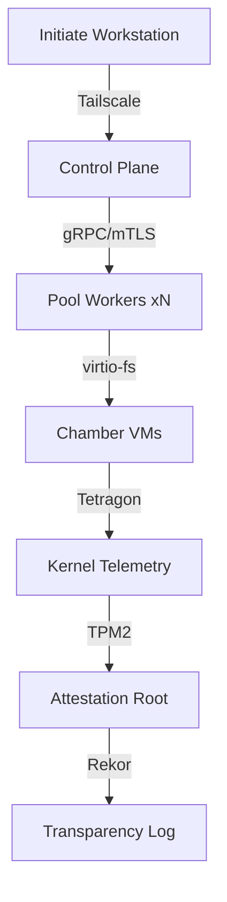
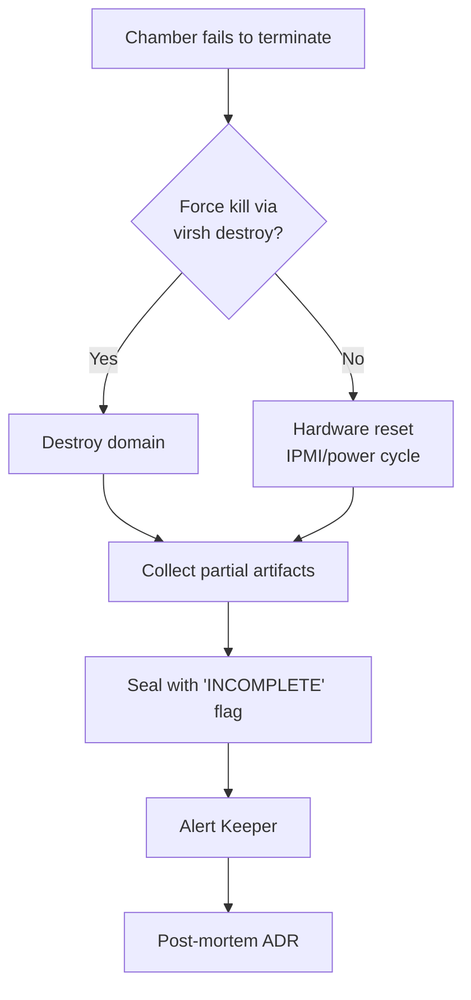
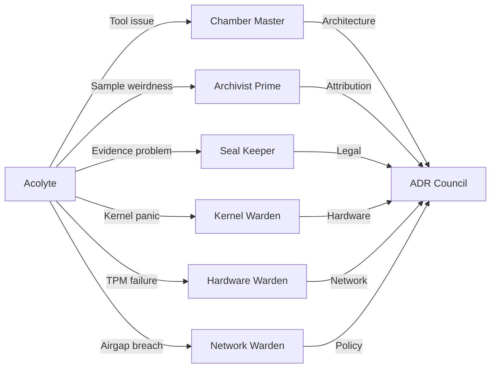

> *"In the beginning was the Sample, and the Sample was with the Void, and the Sample was the Void."*  
> — *Liber Analyticus, Fragment 0x0*

---

## 🜁 I. THE COVENANT

### Purpose
The **Alter** (Automated Lab for Threat Extraction & Research) is a hermetic, air-gapped malware analysis ecosystem. Its purpose: **contain, detonate, extract, attribute, and seal** — without leakage, without compromise, without mercy.

### Scope of Dominion
| Domain | In Scope | Excommunicated |
|--------|----------|----------------|
| **Execution** | Linux ELF, PE, Mach-O, scripts, containers, firmware blobs | Live C2 interaction, credential theft, lateral movement |
| **Observation** | Syscalls, network, memory, filesystem, hardware telemetry | Plaintext exfil, unencrypted artifacts, unsigned logs |
| **Attribution** | YARA, MITRE ATT&CK, SBOM, IOC enrichment, kernel hardening proofs | Speculation, uncorrelated indicators, vendor marketing |

### Occult Framing Glossary
<details>
<summary>▸ <strong>Reveal the Lexicon</strong></summary>

| Term | Meaning |
|------|---------|
| **The Alter** | The totality of the analysis platform — hardware, software, policy, and people |
| **Sample** | A submitted binary, script, or artifact; the *corpus delicti* |
| **Chamber** | An isolated execution environment (VM, container, bare-metal) |
| **Detonation** | Controlled execution of a Sample under full telemetry |
| **Pool** | The worker fleet that pulls Samples, runs Chambers, returns Artifacts |
| **Artifact** | Any output: PCAP, memory dump, strace, YARA hit, SBOM, attestation |
| **Sealing** | Cryptographic binding of Artifacts to TPM2 + sigstore + Rekor transparency log |
| **Acolyte** | You. An initiate learning the rites. |
| **Keeper** | Senior analyst with unseal authority and chamber burn privilege |
| **Warden** | Infrastructure guardian: kernel, TPM, network, hardware |
| **The Void** | The air-gapped network segment; no ingress, mediated egress only |
| **Grimoire** | This document and its sister runbooks |
| **ADR** | Architecture Decision Record — immutable, signed, auditable |

</details>

---

## 🜂 II. ALTAR PREPARATION

### Hardware Requirements


| Component | Minimum | Blessed | Notes |
|-----------|---------|---------|-------|
| **CPU** | 8 cores, VT-x/AMD-V | 16+ cores, SEV-SNP / TDX | Hardware virtualization mandatory |
| **RAM** | 32 GiB | 128+ GiB | 8 GiB per concurrent Chamber |
| **Storage** | 1 TiB NVMe | 4+ TiB ZFS raid-z2 | WAL on separate device |
| **TPM** | 2.0 (firmware) | Discrete TPM2 + PCR policy | PCR 0-7, 16 sealed to boot state |
| **NIC** | 1 Gbps | 10 Gbps + dedicated mgmt | Tailscale subnet router on mgmt |

### Kernel Configuration
```bash
# /etc/kernel/cmdline — blessed by Wardens
root=ZFS=alter/root rw \
  module.sig_enforce=1 \
  lockdown=confidentiality \
  kernel.unprivileged_userns_clone=0 \
  kernel.unprivileged_bpf_disabled=1 \
  slab_nomerge \
  page_poison=1 \
  vsyscall=none \
  module_blacklist=usb-storage,firewire-core,thunderbolt \
  init_on_alloc=1 init_on_free=1 \
  randomize_kstack_offset=on \
  hardening=all
```

Verify:
```bash
$ ./scripts/verify-kernel-hardening.sh --strict --output json
{
  "lockdown": "confidentiality",
  "secureboot": true,
  "tpm2_pcr_policy": "active",
  "tetragon": "enforcing",
  "score": 94
}
```

### TPM2 Provisioning
```bash
# Run once per worker node — Warden only
$ sudo tpm2_createprimary -C o -c primary.ctx
$ sudo tpm2_create -C primary.ctx -G rsa2048:rsaes -u alter.pub -r alter.priv \
    -p "alter:sealing-key" -L alter.policy
$ sudo tpm2_evictcontrol -C o -c 0x81010001 primary.ctx
$ sudo tpm2_pcrread sha256:0,1,2,3,4,5,6,7,16 > /etc/alter/tpm-baseline.json
```

### Tetragon (eBPF Telemetry)
```yaml
# /etc/tetragon/tetragon-config.yaml
tracing-policy:
  - name: alter-syscall-policy
    spec:
      kprobes:
        - call: "sys_execve"
          syscall: true
          args:
            - index: 0
              type: "string"
        - call: "sys_connect"
          syscall: true
        - call: "sys_sendmsg"
          syscall: true
      selectors:
        - matchPIDs: [POOL_WORKER_PID]
      actions:
        - type: "file"
          file: "/var/log/tetragon/alter-syscalls.log.json"
```

### Tailscale (Control Plane Only)
```bash
# Control plane node
$ tailscale up --advertise-routes=10.42.0.0/16 --advertise-tags=tag:alter-control
$ tailscale set --operator=$USER

# Worker nodes (auto-join via auth key)
$ tailscale up --authkey=$TAILSCALE_AUTHKEY --advertise-tags=tag:alter-worker
```

---

## 🜃 III. FIRST SUMMONING

### 1. Clone the Grimoire
```bash
$ git clone git@github.com:alter-labs/alter.git
$ cd alter
$ git verify-commit HEAD  # Verify signed commits
```

### 2. Run the Rite of Passage
```bash
$ ./scripts/e2e-test.sh --sample=test/samples/hello.elf --chamber=qemu --trace
```

<details>
<summary>▸ <strong>Expected Output</strong></summary>

```text
🜏 ALTER E2E TEST — INITIATE RITE
═══════════════════════════════════
[00:00:00] Verifying TPM2 attestation... ✓ PCRs match baseline
[00:00:02] Spawning Chamber: qemu-alter-001 (SEV-SNP)
[00:00:05] Injecting Sample: hello.elf (SHA256: a1b2c3...)
[00:00:06] Tetragon attached (PID 8847)
[00:00:07] Detonation initiated
[00:00:12] Sample exited: code 0
[00:00:13] Collecting artifacts...
    ├── pcap:     artifacts/hello.elf/hello.pcap (2.1 KiB)
    ├── memdump:  artifacts/hello.elf/hello.mem (128 MiB)
    ├── strace:   artifacts/hello.elf/hello.strace (4.7 KiB)
    ├── yara:     artifacts/hello.elf/hello.yara.json (3 hits)
    └── sbom:     artifacts/hello.elf/hello.sbom.json (42 packages)
[00:00:18] Sealing artifacts to TPM2...
[00:00:20] Submitting to Rekor transparency log... ✓ (entry: abc123...)
[00:00:21] VERDICT: PASS — Initiate recognized by the Alter
```

</details>

### 3. Submit Your First Sample
```bash
$ ./scripts/submit-sample.sh \
    --file ~/suspicious.bin \
    --tags "suspect,elf,linux" \
    --priority high \
    --requestor "$(git config user.email)"
```

### 4. Verify Artifacts
```bash
$ ./scripts/verify-artifacts.sh --sample suspicious.bin --full
```
- Checks: TPM2 quote validity, Rekor inclusion proof, signature chain, hash integrity

---

## 🜄 IV. DAILY RITES

### Morning: Pool Worker Health
```bash
$ ./scripts/chamber-pool.sh status --format table
```
```text
┌──────────────┬─────────┬──────────┬──────────┬──────────────┐
│ CHAMBER      │ STATE   │ SAMPLE   │ UPTIME   │ LAST HEARTBEAT│
├──────────────┼─────────┼──────────┼──────────┼──────────────┤
│ qemu-001     │ BUSY    │ ransom.elf│ 4d 12h  │ 2s ago       │
│ qemu-002     │ IDLE    │ —        │ 4d 12h  │ 1s ago       │
│ firecracker-01│ IDLE   │ —        │ 3d 8h   │ 3s ago       │
│ baremetal-01 │ MAINT   │ —        │ —       │ 4h ago       │
└──────────────┴─────────┴──────────┴──────────┴──────────────┘
```

### Midday: Evidence Sealing Check
```bash
$ ./scripts/attest-evidence.sh --since 24h --verify-all
```
- Confirms every artifact from last 24h has valid TPM2 quote + Rekor entry

### Evening: Log Review
```bash
$ ./scripts/log-review.sh --level WARN --since 24h --group-by chamber
```
<details>
<summary>▸ <strong>Common Patterns</strong></summary>

| Pattern | Meaning | Action |
|---------|---------|--------|
| `CHAMBER_BOOT_TIMEOUT` | VM failed to boot in 60s | Check QEMU logs, reset chamber |
| `TETRAGON_DROPPED_EVENTS` | eBPF ring buffer overflow | Increase buffer, reduce syscall filter |
| `TPM_QUOTE_FAILED` | PCR mismatch or TPM busy | Reboot worker, re-provision TPM |
| `REKOR_INCLUSION_TIMEOUT` | Transparency log lag | Wait + retry, check network |
| `ARTIFACT_HASH_MISMATCH` | Corruption detected | **ESCALATE TO KEEPER** |

</details>

---

## 🜂 V. TOOL GRIMOIRE

Each tool is a **signed, versioned, reproducible** binary. Run with `--help` for liturgy.

### `detonate.sh` — The Primary Rite
```bash
$ ./detonate.sh --sample malware.elf --chamber qemu --profile full --timeout 300
```
**Profiles**: `quick` (syscalls only), `standard` (+pcap, strace), `full` (+memdump, yara, sbom)

### `chamber-pool.sh` — Fleet Command
```bash
$ ./chamber-pool.sh scale --target 12 --chamber-type firecracker
$ ./chamber-pool.sh drain --chamber qemu-003 --graceful
$ ./chamber-pool.sh logs qemu-001 --follow --since 1h
```

### `extract-iocs.sh` — Indicator Extraction
```bash
$ ./extract-iocs.sh --artifacts artifacts/malware.elf/ --format stix2.1 --enrich
```
Outputs: IPs, domains, hashes, mutexes, registry keys, MITRE techniques

### `analyze-pcap.sh` — Network Divination
```bash
$ ./analyze-pcap.sh --pcap artifacts/malware.elf/traffic.pcap --zeek --suricata
```
Generates: Zeek logs, Suricata alerts, TLS fingerprint (JA3/JA3S), beaconing analysis

### `attack-tagger.sh` — MITRE Mapping
```bash
$ ./attack-tagger.sh --artifacts artifacts/malware.elf/ --technique T1059.001 --confidence high
```
Maps observed behaviors to ATT&CK; stores in `/var/lib/alter/attack-db.sqlite`

### `gen-yara.sh` — Signature Forging
```bash
$ ./gen-yara.sh --sample malware.elf --cluster --min-support 3 --output rules/
```
Clusters similar samples, generates parametrized YARA with meta: `alter_cluster_id`, `alter_confidence`

### `attest-evidence.sh` — Cryptographic Sealing
```bash
$ ./attest-evidence.sh --dir artifacts/malware.elf/ --tpm-pcr 0,1,2,7,16 --rekor
```
Produces: `evidence.bundle` (tar.zst + sigstore bundle + TPM quote + Rekor receipt)

### `memory-forensics.sh` — Volatility Rite
```bash
$ ./memory-forensics.sh --memdump artifacts/malware.elf/malware.mem --plugins linux.pslist,linux.netstat,linux.malfind
```
Outputs JSONL; auto-tags injected code, hidden modules, anomalous connections

### `airgap-mediator.sh` — The Only Egress
```bash
$ ./airgap-mediator.sh --request ioc-enrichment --payload '{"hashes":["sha256:..."]}' --verify-signature
```
**Mediator policy**: allowlist-only domains, size limits, mandatory human approval for new domains

### `replay-pcap.sh` — Traffic Resurrection
```bash
$ ./replay-pcap.sh --pcap artifacts/malware.elf/traffic.pcap --chamber qemu-fresh --modify "s/evil.c2/localhost/"
```
Replays captured traffic against fresh chamber for behavioral verification

### `gen-sbom.sh` — Software Bill of Materials
```bash
$ ./gen-sbom.sh --sample malware.elf --format cyclonedx-json --sign
```
Includes: embedded libraries, interpreter deps, container layers, kernel modules

### `enrich-iocs.sh` — Threat Intelligence Fusion
```bash
$ ./enrich-iocs.sh --iocs iocs.json --sources virustotal,urlhaus,alienvault,greynoise --cache 7d
```
Respects API quotas; caches in `/var/cache/alter/enrichment/`

### `sign-evidence.sh` — Sigstore Signing
```bash
$ ./sign-evidence.sh --bundle evidence.bundle --identity "alter-pool@alter.lab" --fulcio
```
Uses **Fulcio** for short-lived certs, **Rekor** for transparency, **Cosign** for verification

### `verify-kernel-hardening.sh` — Warden's Audit
```bash
$ ./verify-kernel-hardening.sh --strict --output sarif --upload-codeql
```
Checks 80+ hardening flags; fails CI if score < 90

---

## 🜁 VI. EMERGENCY RITES

### Chamber Burn Failure


**Incantation**:
```bash
$ ./scripts/emergency-burn.sh --chamber qemu-007 --reason "hang: malloc loop" --preserve-memory
```

### Pool Deadlock
```bash
$ ./chamber-pool.sh emergency-drain --all --timeout 60
$ ./chamber-pool.sh reset --confirm "I ACCEPT DATA LOSS"
```
**Last resort**: `systemctl restart alter-pool` on control plane

### Evidence Corruption
```bash
$ ./scripts/verify-artifacts.sh --sample suspicious.bin --repair
```
If repair fails:
1. Quarantine: `mv artifacts/suspicious.bin /quarantine/`
2. Re-detonate from original sample (immutable in `/samples/incoming/`)
3. File ADR with root cause

### TPM Unseal Failure
```bash
$ sudo tpm2_pcrread sha256:0,1,2,3,4,5,6,7,16 > current.pcr
$ diff /etc/alter/tpm-baseline.json current.pcr
```
- **PCR 0-7 changed**: Kernel/initrd modified → **FULL REPROVISION REQUIRED**
- **PCR 16 changed**: Bootloader policy → Check `systemd-stub` / `grub` updates
- Contact **Warden of the Wire** immediately

---

## 🜃 VII. ADVANCEMENT

### Contributing Rules
1. **All changes via PR** — signed commits (`git commit -S`)
2. **ADR required** for: new chamber types, tool interfaces, policy changes, crypto params
3. **Tests mandatory**: unit + integration + e2e for new tools
4. **YARA CI**: New rules must pass `./scripts/yara-ci.sh --test-rules rules/new/`
5. **Documentation**: Update this Grimoire + relevant runbook

### YARA CI Pipeline
```yaml
# .github/workflows/yara-ci.yml
jobs:
  yara-test:
    runs-on: alter-runner
    steps:
      - uses: actions/checkout@v4
      - name: Test rules
        run: |
          ./scripts/yara-ci.sh \
            --rules rules/ \
            --samples test/samples/ \
            --false-positive-corpus /corpus/benign/ \
            --max-fp-rate 0.001
      - name: Compile & lint
        run: yara-lint rules/ && yarac rules/ /tmp/compiled.yar
```

### Adding Runbooks
1. Create `docs/runbooks/XXX-descriptive-name.md`
2. Follow template: `docs/templates/runbook-template.md`
3. Add to `docs/RUNBOOK_INDEX.yaml`
4. PR must include: dry-run video (asciicast), reviewer from Keepers

### ADR Process
```bash
$ ./scripts/adr-new.sh "Switch chamber runtime to gVisor"
```
Creates `docs/adr/0042-gvisor-runtime.md` with:
- Context & problem
- Options considered (table)
- Decision + consequences
- Sign-off: 2 Keepers + 1 Warden
- Immutable: merged ADRs never modified; superseded by new ADR

---

## 🜄 VIII. CONTACTS & ESCALATION

### Keepers of the Alter (Analytical Authority)
| Title | Handle | PGP Fingerprint | Domain |
|-------|--------|-----------------|--------|
| **Archivist Prime** | `@archivist-prime` | `A1B2 C3D4 E5F6...` | Sample triage, YARA, attribution |
| **Chamber Master** | `@chamber-master` | `B2C3 D4E5 F6A7...` | Chamber lifecycle, pool scaling |
| **Seal Keeper** | `@seal-keeper` | `C3D4 E5F6 A7B8...` | Evidence sealing, TPM, Rekor, legal hold |

### Wardens of the Wire (Infrastructure Authority)
| Title | Handle | PGP Fingerprint | Domain |
|-------|--------|-----------------|--------|
| **Kernel Warden** | `@kernel-warden` | `D4E5 F6A7 B8C9...` | Kernel config, hardening, eBPF, Tetragon |
| **Hardware Warden** | `@hw-warden` | `E5F6 A7B8 C9D0...` | TPM, SEV-SNP, IPMI, hardware procurement |
| **Network Warden** | `@net-warden` | `F6A7 B8C9 D0E1...` | Tailscale, airgap mediator, DNS, egress policy |

### Escalation Matrix


### Emergency Summoning
```bash
# Pages all Keepers + Wardens via Alertmanager
$ ./scripts/page-alter.sh --severity critical --reason "CHAMBER ESCAPE DETECTED" --chamber qemu-009
```

---

## 🜏 CLOSING INCANTATION

> *You have read the Grimoire.  
> You have prepared the Altar.  
> You have performed the First Summoning.  
>   
> Now: **detonate, extract, seal, repeat.**  
>   
> The Alter remembers.  
> The Alter verifies.  
> The Alter endures.*

---

*Version: 0.1.0 | Last Sealed: 2026-08-31T00:00:00Z | Seal: `sigstore:sha256:...` | ADR: 0001*
