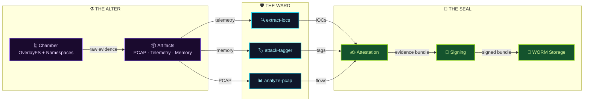
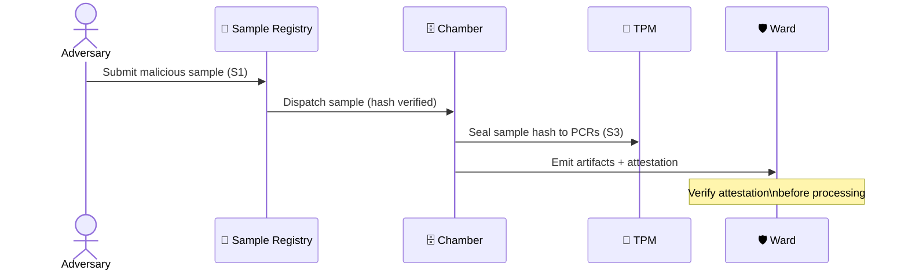
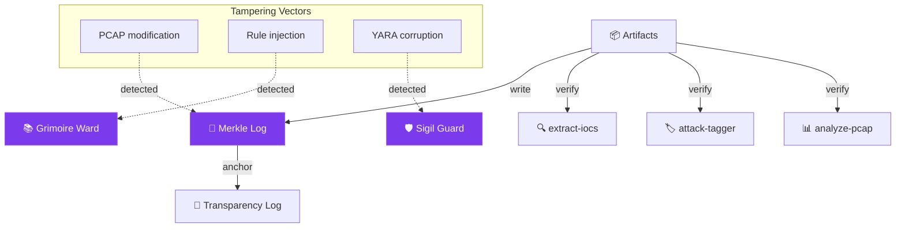
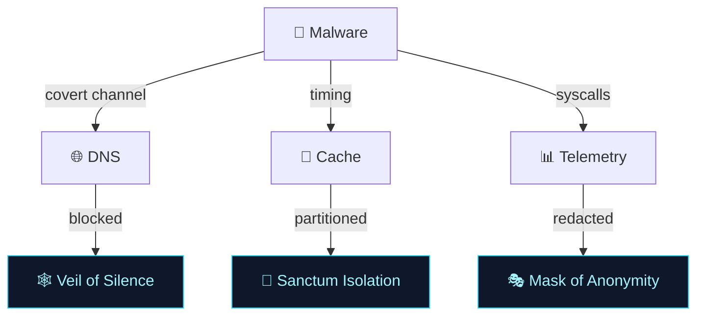
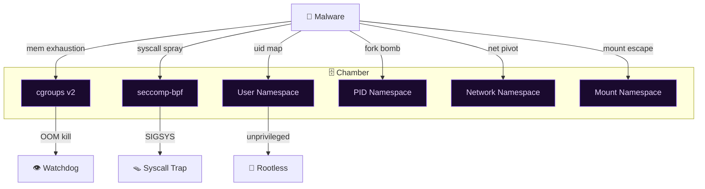
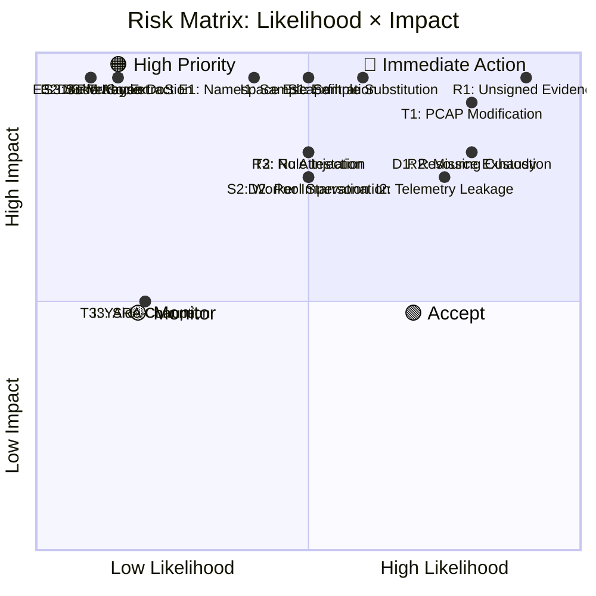

---

## 🏛️ Architecture Overview

---

## 📜 STRIDE Threat Matrix

| # | STRIDE | Threat | Likelihood | Impact | Current Mitigations | Recommended Mitigations |
|---|--------|--------|------------|--------|---------------------|-------------------------|
| **S1** | **Spoofing** | **Sample Substitution** — Adversary swaps malware sample pre-detonation | **Medium** | **Critical** | Content-addressed storage (SHA-256), immutable sample registry | **Veil of Integrity**: Signed sample manifests, TPM-bound sample sealing, in-toto attestation |
| **S2** | **Spoofing** | **Worker Impersonation** — Compromised analysis node claims false results | **Medium** | **High** | mTLS between Ward components, SPIFFE identity | **Ward Sentinel**: Short-lived workload certs, attestation-based admission, zero-trust mesh |
| **S3** | **Spoofing** | **TPM Key Extraction** — Physical/local attacker extracts sealing keys | **Low** | **Critical** | TPM 2.0 with PCR binding, sealed storage | **Obsidian Vault**: TPM-locked keys, PCR policy binding to measured boot, anti-hammering |
| **T1** | **Tampering** | **PCAP/Telemetry Modification** — Alter network captures or syscall logs post-collection | **High** | **Critical** | Append-only artifact store, Merkle tree hashing | **Chronicle Chain**: Hash-linked artifact log, periodic anchoring to transparency log, WORM enforcement |
| **T2** | **Tampering** | **Rule Injection** — Malicious YARA/Sigma rules injected into analysis pipeline | **Medium** | **High** | Rule registry with signed packages, review workflow | **Grimoire Ward**: Signed rule bundles, reproducible builds, canary rule testing, diff attestation |
| **T3** | **Tampering** | **YARA Rule Corruption** — Bit-flip or supply-chain compromise of detection rules | **Low** | **Medium** | Checksum verification, version pinning | **Sigil Guard**: Reproducible rule compilation, SBOM for rules, automated regression on rule change |
| **R1** | **Repudiation** | **Unsigned Evidence** — Artifacts lack cryptographic proof of origin | **High** | **Critical** | None (gap) | **Seal of Witness**: Mandatory cosign/Notary v2 signing, RFC 3161 timestamps, transparency log |
| **R2** | **Repudiation** | **Missing Chain of Custody** — No verifiable handoff log between Alter → Ward → Seal | **High** | **High** | Basic audit logging | **Ledger of Custody**: Immutable transfer receipts, CSP (Custody Sequence Protocol), witness quorum |
| **R3** | **Repudiation** | **No Attestation** — Analysis results cannot be tied to specific chamber execution | **Medium** | **High** | Chamber metadata in artifacts | **Attestation Root**: In-toto layout, SLSA provenance, TPM quote over chamber PCRs |
| **I1** | **Info Disclosure** | **Sample Exfiltration** — Malware leaks via chamber network covert channel | **Medium** | **Critical** | Network namespace isolation, egress deny | **Veil of Silence**: Zero-egress chamber, DNS sinkhole, TLS inspection, traffic shaping |
| **I2** | **Info Disclosure** | **Telemetry Leakage** — Sensitive host/system data in syscall/memory captures | **High** | **High** | Redaction filters, PII scrubbing | **Mask of Anonymity**: Differential privacy on telemetry, synthetic host profiles, kernel-level redaction |
| **I3** | **Info Disclosure** | **Side-Channel Leakage** — Timing/cache attacks reveal sample behavior to co-tenants | **Low** | **Medium** | Dedicated chamber nodes | **Sanctum Isolation**: Single-tenant chambers, cache partitioning (CAT), constant-time artifact write |
| **D1** | **DoS** | **Chamber Resource Exhaustion** — Malware consumes all CPU/RAM/disk in namespace | **High** | **High** | cgroups v2 limits, pids.max, memory.max | **Bound Crucible**: Hard resource quotas, OOM kill priority, disk quota with reservation, watchdog |
| **D2** | **DoS** | **Pool Starvation** — All chambers occupied, analysis queue backs up indefinitely | **Medium** | **High** | Queue depth monitoring, autoscaling | **Reservoir Protocol**: Priority inversion prevention, dead-letter queue, burst capacity reservation |
| **D3** | **DoS** | **Tetragon/eBPF DoS** — Malicious probe crashes kernel tracer, blinds observability | **Low** | **Critical** | Tetragon health checks, fallback logging | **Aegis Fallback**: Kernel auditd fallback, userspace syscall shim, probe validation sandbox |
| **E1** | **EoP** | **Namespace Escape** — Breakout from user/mount/net/pid namespace to host | **Medium** | **Critical** | User namespaces, seccomp, no-new-privs | **Warded Boundary**: gVisor/Kata fallback, syscall whitelist, CRI-O with Kata, runtime class |
| **E2** | **EoP** | **Sudo Wrapper Abuse** — Compromised analysis tool escalates via sudoers misconfig | **Low** | **Critical** | No sudo in containers, capability drop | **Keyless Ward**: Rootless throughout, capability bounding set, ambient capabilities denied |
| **E3** | **EoP** | **Docker Socket Access** — Chamber mounts /var/run/docker.sock, escapes to host | **Low** | **Critical** | Socket not mounted by default | **Socket Seal**: Podman rootless, socket activation with SELinux, socket proxy with ACL |

---

## 🔮 Threat Flow Diagrams

### Spoofing Attack Surface

### Tampering Attack Surface

### Repudiation Chain of Custody

### Information Disclosure Vectors

### DoS & Elevation of Privilege

---

## 📊 Risk Heat Map

---

## 🛡️ Mitigation Status Tracker

| Mitigation | Status | Component | Validation |
|------------|--------|-----------|------------|
| Content-addressed storage | ✅ Implemented | Registry | SHA-256 verification on dispatch |
| Append-only artifact log | ✅ Implemented | Chamber | Merkle root per detonation |
| cgroups v2 hard limits | ✅ Implemented | Chamber | CPU/RAM/pids/disk quotas |
| User namespaces + seccomp | ✅ Implemented | Chamber | Rootless, no-new-privs, syscall filter |
| Network namespace zero-egress | ✅ Implemented | Chamber | DNS sinkhole, deny-all egress |
| mTLS Ward mesh | 🟡 Partial | Ward | SPIFFE certs, need rotation automation |
| Signed rule bundles | 🟡 Partial | Ward | cosign verify, need reproducible builds |
| Mandatory evidence signing | ❌ Gap | Seal | **Priority 1**: cosign/Notary v2 integration |
| Chain of custody ledger | ❌ Gap | Seal | **Priority 1**: CSP protocol design |
| In-toto attestation | ❌ Gap | Seal | **Priority 2**: SLSA provenance generation |
| TPM PCR binding | 🟡 Partial | Chamber | PCR 0-7 measured, need policy sealing |
| gVisor/Kata fallback | ❌ Planned | Chamber | **Priority 2**: RuntimeClass for high-risk |
| Transparency log anchoring | ❌ Planned | Seal | **Priority 2**: Rekor/Trillian integration |
| Differential privacy telemetry | ❌ Research | Ward | **Priority 3**: Evaluate utility tradeoff |

---

## 🕯️ Occult Glossary

| Term | Mundane Meaning |
|------|-----------------|
| **Alter** | Detonation environment (chamber + artifact collection) |
| **Ward** | Analysis pipeline (extract-iocs, attack-tagger, analyze-pcap) |
| **Seal** | Evidence attestation, signing, and WORM storage |
| **Veil** | Network isolation / egress control |
| **Sanctum** | Single-tenant, hardware-isolated chamber |
| **Grimoire** | Signed, versioned rule registry (YARA, Sigma) |
| **Sigil** | Cryptographic integrity marker (hash, signature) |
| **Chronicle** | Append-only, hash-linked artifact log |
| **Ledger of Custody** | Immutable transfer receipt chain |
| **Aegis** | Fallback observability (auditd, userspace shim) |
| **Obsidian Vault** | TPM-sealed key hierarchy |
| **Reservoir** | Chamber pool with priority/burst management |

---

## 📜 Covenant: Threat Model Maintenance

> *"A model unexamined is a ward unguarded."*

| Trigger | Action | Owner |
|---------|--------|-------|
| New chamber runtime (gVisor, Kata) | Re-evaluate E1, E2, E3 | Platform |
| New analysis component added | Add STRIDE row, update diagrams | Analysis |
| Supply chain incident (rule/pkg) | Activate T2/T3 mitigations | Supply Chain |
| Quarterly | Full review, update heat map | Security |
| Post-incident | Add specific threat, verify mitigations | IR Team |

---

## 🔮 Next Rites

1. **Seal the Evidence** — Implement mandatory cosign signing + RFC 3161 timestamps (R1, R2, R3)
2. **Bind the Ledger** — Design Custody Sequence Protocol for Alter→Ward→Seal transfers (R2)
3. **Harden the Veil** — Deploy zero-egress chamber with DNS sinkhole + TLS inspection (I1)
4. **Forge the Aegis** — Implement auditd fallback + userspace syscall shim (D3)
5. **Anchor the Chronicle** — Integrate Rekor transparency log for artifact anchoring (T1)

---

*Sealed with the Sign of the Alter. Let no artifact pass unchallenged, no evidence stand unsealed, no threat dwell unmeasured.*

**Version**: 1.0.0 | **Classification**: ARCANUM RESTRICTED | **Custodian**: Malware Research Cabal
